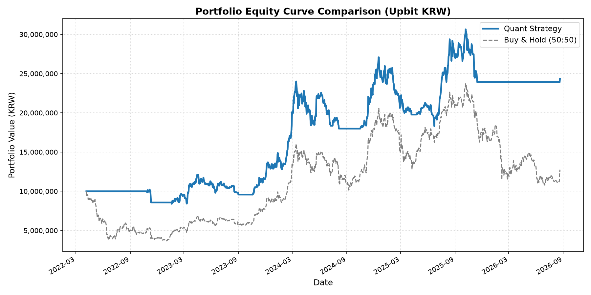

# 📊 업비트 KRW 시세 기반 퀀트 전략 백테스트 보고서
⏱️ **작성 일시**: 2026-08-21 09:26:53
🔍 **백테스트 대상 전략**: 메인 전략 (BTC & ETH 50:50 자동 비중 조절 및 추세 추종)
⚙️ **전략 파라미터**: BTC 이동평균: **200일** (버퍼 ±2%) | ETH 이동평균: **150일** (ATR배수 1.5배)

## 1. 종합 성과 분석 결과
- **백테스트 기간**: 2022-04-06 ~ 2026-08-21 (약 4.38년)
- **초기 가입금**: 10,000,000 원
- **최종 자산 총액**: 24,319,259 원

| 지표 | 퀀트 리밸런싱 전략 (Quant) | 단순 보유 전략 (Buy & Hold) |
| :--- | :---: | :---: |
| **누적 수익률** | **+143.19%** | +27.53% |
| **연평균 성장률 (CAGR)** | **22.52%** | 5.72% |
| **최대 낙폭 (MDD)** | **-32.40%** | -63.29% |

> 💡 **주요 성과 요약**: 단순 보유 대비 **+115.66%p**의 초과 수익률을 기록하였으며, 최대 낙폭(MDD) 방어 측면에서 벤치마크 대비 **-30.89%p** 만큼의 낙폭 축소 효과(자산 방어)를 달성하였습니다.

## 2. 자산 가치 변동 추이 차트

## 3. 백테스트 기간 중 매매 거래 내역 (총 218건)
| 거래 일시 | 거래 구분 | 거래 금액 및 수량 | 수수료 |
| :---: | :---: | :--- | :---: |
| 2022-10-27 | 🔵 매수 | 업비트 ETH: 5,000,000원 (2.277803개) | 2,500원 |
| 2022-10-28 | 🔵 매수 | 업비트 ETH: 70,723원 (0.033140개) | 35원 |
| 2022-10-29 | 🔴 매도 | 업비트 ETH: 58,911원 (0.026974개) | 29원 |
| 2022-10-30 | 🔴 매도 | 업비트 ETH: 90,232원 (0.039873개) | 45원 |
| 2022-10-31 | 🔵 매수 | 업비트 ETH: 32,517원 (0.014548개) | 16원 |
| 2022-11-01 | 🔵 매수 | 업비트 ETH: 30,500원 (0.013813개) | 15원 |
| 2022-11-02 | 🔴 매도 | 업비트 ETH: 9,082원 (0.004100개) | 5원 |
| 2022-11-03 | 🔵 매수 | 업비트 ETH: 65,780원 (0.030481개) | 33원 |
| 2022-11-04 | 🔴 매도 | 업비트 ETH: 20,673원 (0.009505개) | 10원 |
| 2022-11-05 | 🔴 매도 | 업비트 ETH: 127,063원 (0.055583개) | 64원 |
| 2022-11-06 | 🔵 매수 | 업비트 ETH: 11,137원 (0.004891개) | 6원 |
| 2022-11-07 | 🔵 매수 | 업비트 ETH: 73,878원 (0.033412개) | 37원 |
| 2022-11-09 | 🔵 매수 | 업비트 ETH: 332,874원 (0.173556개) | 166원 |
| 2022-11-10 | 🔴 매도 | 업비트 ETH: 3,887,296원 (2.445609개) | 1,944원 |
| 2023-01-17 | 🔵 매수 | 업비트 ETH: 4,286,876원 (2.186646개) | 2,143원 |
| 2023-01-18 | 🔵 매수 | 업비트 ETH: 16,925원 (0.008697개) | 8원 |
| 2023-01-19 | 🔵 매수 | 업비트 ETH: 70,804원 (0.037633개) | 35원 |
| 2023-01-20 | 🔴 매도 | 업비트 ETH: 54,132원 (0.028062개) | 27원 |
| 2023-01-21 | 🔴 매도 | 업비트 ETH: 132,308원 (0.064572개) | 66원 |
| 2023-01-21 | 🔵 매수 | 업비트 BTC: 4,381,109원 (0.156250개) | 2,191원 |
| 2023-06-15 | 🔴 매도 | 업비트 BTC: 255,285원 (0.007734개) | 128원 |
| 2023-06-15 | 🔴 매도 | 업비트 ETH: 4,642,401원 (2.140342개) | 2,321원 |
| 2023-06-16 | 🔴 매도 | 업비트 BTC: 34,046원 (0.001018개) | 17원 |
| 2023-06-17 | 🔴 매도 | 업비트 BTC: 78,625원 (0.002278개) | 39원 |
| 2023-06-18 | 🔴 매도 | 업비트 BTC: 19,261원 (0.000554개) | 10원 |
| 2023-06-19 | 🔵 매수 | 업비트 BTC: 22,708원 (0.000659개) | 11원 |
| 2023-06-20 | 🔴 매도 | 업비트 BTC: 45,699원 (0.001302개) | 23원 |
| 2023-06-21 | 🔴 매도 | 업비트 BTC: 133,953원 (0.003625개) | 67원 |
| 2023-06-22 | 🔴 매도 | 업비트 BTC: 153,067원 (0.003911개) | 77원 |
| 2023-06-22 | 🔵 매수 | 업비트 ETH: 5,335,994원 (2.160991개) | 2,668원 |
| 2023-08-18 | 🔴 매도 | 업비트 ETH: 4,994,050원 (2.160991개) | 2,497원 |
| 2023-08-19 | 🔵 매수 | 업비트 BTC: 48,577원 (0.001352개) | 24원 |
| 2023-08-20 | 🔴 매도 | 업비트 BTC: 11,842원 (0.000328개) | 6원 |
| 2023-08-21 | 🔵 매수 | 업비트 BTC: 8,591원 (0.000239개) | 4원 |
| 2023-08-22 | 🔵 매수 | 업비트 BTC: 12,193원 (0.000341개) | 6원 |
| 2023-08-23 | 🔵 매수 | 업비트 BTC: 5,734원 (0.000161개) | 3원 |
| 2023-08-24 | 🔴 매도 | 업비트 BTC: 17,626원 (0.000490개) | 9원 |
| 2023-08-25 | 🔵 매수 | 업비트 BTC: 20,315원 (0.000570개) | 10원 |
| 2023-08-26 | 🔴 매도 | 업비트 BTC: 4,907,825원 (0.138330개) | 2,454원 |
| 2023-08-30 | 🔵 매수 | 업비트 BTC: 4,918,154원 (0.131292개) | 2,459원 |
| 2023-08-31 | 🔵 매수 | 업비트 BTC: 22,958원 (0.000618개) | 11원 |
| 2023-09-01 | 🔴 매도 | 업비트 BTC: 4,683,073원 (0.131910개) | 2,342원 |
| 2023-10-17 | 🔵 매수 | 업비트 BTC: 4,787,964원 (0.123703개) | 2,394원 |
| 2023-10-20 | 🔴 매도 | 업비트 BTC: 18,224원 (0.000467개) | 9원 |
| 2023-10-21 | 🔴 매도 | 업비트 BTC: 77,027원 (0.001914개) | 39원 |
| 2023-10-22 | 🔴 매도 | 업비트 BTC: 9,482원 (0.000235개) | 5원 |
| 2023-10-24 | 🔴 매도 | 업비트 BTC: 228,433원 (0.005171개) | 114원 |
| 2023-10-25 | 🔴 매도 | 업비트 BTC: 82,010원 (0.001799개) | 41원 |
| 2023-10-26 | 🔴 매도 | 업비트 BTC: 50,917원 (0.001095개) | 25원 |
| 2023-10-27 | 🔵 매수 | 업비트 BTC: 19,484원 (0.000422개) | 10원 |
| 2023-10-28 | 🔵 매수 | 업비트 BTC: 9,080원 (0.000197개) | 5원 |
| 2023-10-29 | 🔴 매도 | 업비트 BTC: 19,090원 (0.000412개) | 10원 |
| 2023-10-30 | 🔴 매도 | 업비트 BTC: 28,822원 (0.000616개) | 14원 |
| 2023-10-31 | 🔵 매수 | 업비트 BTC: 5,117원 (0.000109개) | 3원 |
| 2023-10-31 | 🔵 매수 | 업비트 ETH: 5,262,763원 (2.146993개) | 2,631원 |
| 2024-07-05 | 🔴 매도 | 업비트 ETH: 9,401,680원 (2.146993개) | 4,701원 |
| 2024-07-05 | 🔵 매수 | 업비트 BTC: 99,839원 (0.001222개) | 50원 |
| 2024-07-06 | 🔵 매수 | 업비트 BTC: 29,693원 (0.000366개) | 15원 |
| 2024-07-07 | 🔴 매도 | 업비트 BTC: 98,986원 (0.001195개) | 49원 |
| 2024-07-08 | 🔴 매도 | 업비트 BTC: 8,981,110원 (0.113116개) | 4,491원 |
| 2024-07-15 | 🔵 매수 | 업비트 BTC: 9,174,136원 (0.107334개) | 4,587원 |
| 2024-07-16 | 🔴 매도 | 업비트 BTC: 305,326원 (0.003349개) | 153원 |
| 2024-07-17 | 🔵 매수 | 업비트 BTC: 17,445원 (0.000192개) | 9원 |
| 2024-07-18 | 🔵 매수 | 업비트 BTC: 70,897원 (0.000792개) | 35원 |
| 2024-07-19 | 🔴 매도 | 업비트 BTC: 20,241원 (0.000225개) | 10원 |
| 2024-07-20 | 🔴 매도 | 업비트 BTC: 165,186원 (0.001776개) | 83원 |
| 2024-07-21 | 🔴 매도 | 업비트 BTC: 55,077원 (0.000585개) | 28원 |
| 2024-07-22 | 🔴 매도 | 업비트 BTC: 47,468원 (0.000500개) | 24원 |
| 2024-07-23 | 🔵 매수 | 업비트 BTC: 36,462원 (0.000387개) | 18원 |
| 2024-07-24 | 🔵 매수 | 업비트 BTC: 105,346원 (0.001142개) | 53원 |
| 2024-07-25 | 🔵 매수 | 업비트 BTC: 37,409원 (0.000409개) | 19원 |
| 2024-07-26 | 🔴 매도 | 업비트 BTC: 50,551원 (0.000547개) | 25원 |
| 2024-07-27 | 🔴 매도 | 업비트 BTC: 111,754원 (0.001181개) | 56원 |
| 2024-07-28 | 🔵 매수 | 업비트 BTC: 15,184원 (0.000161개) | 8원 |
| 2024-07-29 | 🔴 매도 | 업비트 BTC: 52,247원 (0.000548개) | 26원 |
| 2024-07-30 | 🔵 매수 | 업비트 BTC: 89,385원 (0.000954개) | 45원 |
| 2024-07-31 | 🔵 매수 | 업비트 BTC: 41,856원 (0.000451개) | 21원 |
| 2024-08-01 | 🔵 매수 | 업비트 BTC: 126,011원 (0.001394개) | 63원 |
| 2024-08-02 | 🔴 매도 | 업비트 BTC: 75,368원 (0.000821개) | 38원 |
| 2024-08-03 | 🔵 매수 | 업비트 BTC: 264,269원 (0.003047개) | 132원 |
| 2024-08-04 | 🔵 매수 | 업비트 BTC: 39,396원 (0.000458개) | 20원 |
| 2024-08-05 | 🔴 매도 | 업비트 BTC: 8,775,584원 (0.107188개) | 4,388원 |
| 2024-10-16 | 🔵 매수 | 업비트 BTC: 8,992,224원 (0.099292개) | 4,496원 |
| 2024-10-17 | 🔴 매도 | 업비트 BTC: 51,965원 (0.000567개) | 26원 |
| 2024-10-18 | 🔴 매도 | 업비트 BTC: 7,319원 (0.000080개) | 4원 |
| 2024-10-19 | 🔴 매도 | 업비트 BTC: 78,918원 (0.000845개) | 39원 |
| 2024-10-21 | 🔴 매도 | 업비트 BTC: 26,572원 (0.000283개) | 13원 |
| 2024-10-22 | 🔵 매수 | 업비트 BTC: 84,833원 (0.000920개) | 42원 |
| 2024-10-23 | 🔴 매도 | 업비트 BTC: 35,219원 (0.000379개) | 18원 |
| 2024-10-24 | 🔵 매수 | 업비트 BTC: 24,604원 (0.000266개) | 12원 |
| 2024-10-25 | 🔴 매도 | 업비트 BTC: 83,667원 (0.000889개) | 42원 |
| 2024-10-26 | 🔵 매수 | 업비트 BTC: 15,325원 (0.000163개) | 8원 |
| 2024-10-27 | 🔴 매도 | 업비트 BTC: 11,269원 (0.000120개) | 6원 |
| 2024-10-28 | 🔴 매도 | 업비트 BTC: 40,505원 (0.000427개) | 20원 |
| 2024-10-29 | 🔴 매도 | 업비트 BTC: 125,060원 (0.001284개) | 63원 |
| 2024-10-30 | 🔴 매도 | 업비트 BTC: 186,729원 (0.001843개) | 93원 |
| 2024-10-31 | 🔵 매수 | 업비트 BTC: 34,188원 (0.000340개) | 17원 |
| 2024-11-01 | 🔵 매수 | 업비트 BTC: 115,905원 (0.001181개) | 58원 |
| 2024-11-02 | 🔵 매수 | 업비트 BTC: 37,300원 (0.000383개) | 19원 |
| 2024-11-03 | 🔵 매수 | 업비트 BTC: 6,046원 (0.000062개) | 3원 |
| 2024-11-04 | 🔵 매수 | 업비트 BTC: 58,398원 (0.000608개) | 29원 |
| 2024-11-05 | 🔵 매수 | 업비트 BTC: 81,941원 (0.000869개) | 41원 |
| 2024-11-06 | 🔴 매도 | 업비트 BTC: 92,818원 (0.000965개) | 46원 |
| 2024-11-07 | 🔴 매도 | 업비트 BTC: 380,277원 (0.003654개) | 190원 |
| 2024-11-09 | 🔴 매도 | 업비트 BTC: 128,087원 (0.001199개) | 64원 |
| 2024-11-10 | 🔵 매수 | 업비트 BTC: 25,190원 (0.000237개) | 13원 |
| 2024-11-10 | 🔵 매수 | 업비트 ETH: 9,746,519원 (2.248764개) | 4,873원 |
| 2025-02-17 | 🔴 매도 | 업비트 BTC: 2,148,129원 (0.014751개) | 1,074원 |
| 2025-02-17 | 🔴 매도 | 업비트 ETH: 9,060,270원 (2.248764개) | 4,530원 |
| 2025-02-18 | 🔵 매수 | 업비트 BTC: 44,767원 (0.000310개) | 22원 |
| 2025-02-19 | 🔵 매수 | 업비트 BTC: 24,375원 (0.000169개) | 12원 |
| 2025-02-20 | 🔴 매도 | 업비트 BTC: 21,465원 (0.000149개) | 11원 |
| 2025-02-21 | 🔴 매도 | 업비트 BTC: 54,354원 (0.000373개) | 27원 |
| 2025-02-22 | 🔵 매수 | 업비트 BTC: 108,853원 (0.000761개) | 54원 |
| 2025-02-23 | 🔵 매수 | 업비트 BTC: 20,515원 (0.000144개) | 10원 |
| 2025-02-24 | 🔵 매수 | 업비트 BTC: 38,681원 (0.000273개) | 19원 |
| 2025-02-25 | 🔵 매수 | 업비트 BTC: 361,004원 (0.002731개) | 181원 |
| 2025-02-26 | 🔵 매수 | 업비트 BTC: 97,981원 (0.000755개) | 49원 |
| 2025-02-27 | 🔵 매수 | 업비트 BTC: 283,373원 (0.002307개) | 142원 |
| 2025-02-28 | 🔴 매도 | 업비트 BTC: 68,318원 (0.000549개) | 34원 |
| 2025-03-02 | 🔴 매도 | 업비트 BTC: 163,343원 (0.001273개) | 82원 |
| 2025-03-03 | 🔴 매도 | 업비트 BTC: 582,425원 (0.004087개) | 291원 |
| 2025-03-04 | 🔵 매수 | 업비트 BTC: 483,401원 (0.003713개) | 242원 |
| 2025-03-05 | 🔴 매도 | 업비트 BTC: 10,427원 (0.000080개) | 5원 |
| 2025-03-06 | 🔴 매도 | 업비트 BTC: 188,783원 (0.001398개) | 94원 |
| 2025-03-07 | 🔵 매수 | 업비트 BTC: 45,397원 (0.000339개) | 23원 |
| 2025-03-08 | 🔵 매수 | 업비트 BTC: 174,814원 (0.001349개) | 87원 |
| 2025-03-09 | 🔵 매수 | 업비트 BTC: 38,696원 (0.000301개) | 19원 |
| 2025-03-10 | 🔵 매수 | 업비트 BTC: 310,198원 (0.002562개) | 155원 |
| 2025-03-11 | 🔴 매도 | 업비트 BTC: 9,968,239원 (0.084840개) | 4,984원 |
| 2025-03-12 | 🔵 매수 | 업비트 BTC: 10,116,160원 (0.082049개) | 5,058원 |
| 2025-03-13 | 🔴 매도 | 업비트 BTC: 23,686원 (0.000191개) | 12원 |
| 2025-03-14 | 🔵 매수 | 업비트 BTC: 149,590원 (0.001244개) | 75원 |
| 2025-03-15 | 🔴 매도 | 업비트 BTC: 151,166원 (0.001221개) | 76원 |
| 2025-03-16 | 🔴 매도 | 업비트 BTC: 6,506원 (0.000052개) | 3원 |
| 2025-03-17 | 🔵 매수 | 업비트 BTC: 93,815원 (0.000770개) | 47원 |
| 2025-03-18 | 🔴 매도 | 업비트 BTC: 44,621원 (0.000363개) | 22원 |
| 2025-03-19 | 🔵 매수 | 업비트 BTC: 62,858원 (0.000518개) | 31원 |
| 2025-03-20 | 🔴 매도 | 업비트 BTC: 245,019원 (0.001926개) | 123원 |
| 2025-03-21 | 🔵 매수 | 업비트 BTC: 115,724원 (0.000930개) | 58원 |
| 2025-03-22 | 🔴 매도 | 업비트 BTC: 6,961원 (0.000056개) | 3원 |
| 2025-03-23 | 🔵 매수 | 업비트 BTC: 14,296원 (0.000115개) | 7원 |
| 2025-03-24 | 🔴 매도 | 업비트 BTC: 112,986원 (0.000890개) | 56원 |
| 2025-03-25 | 🔴 매도 | 업비트 BTC: 80,065원 (0.000621개) | 40원 |
| 2025-03-27 | 🔵 매수 | 업비트 BTC: 13,391원 (0.000104개) | 7원 |
| 2025-03-28 | 🔴 매도 | 업비트 BTC: 5,826원 (0.000045개) | 3원 |
| 2025-03-29 | 🔵 매수 | 업비트 BTC: 116,567원 (0.000926개) | 58원 |
| 2025-03-30 | 🔵 매수 | 업비트 BTC: 102,699원 (0.000833개) | 51원 |
| 2025-03-31 | 🔵 매수 | 업비트 BTC: 9,388원 (0.000076개) | 5원 |
| 2025-04-01 | 🔴 매도 | 업비트 BTC: 6,697원 (0.000054개) | 3원 |
| 2025-04-02 | 🔴 매도 | 업비트 BTC: 140,593원 (0.001110개) | 70원 |
| 2025-04-03 | 🔵 매수 | 업비트 BTC: 155,471원 (0.001265개) | 78원 |
| 2025-04-04 | 🔴 매도 | 업비트 BTC: 18,479원 (0.000150개) | 9원 |
| 2025-04-05 | 🔴 매도 | 업비트 BTC: 6,782원 (0.000055개) | 3원 |
| 2025-04-06 | 🔵 매수 | 업비트 BTC: 6,320원 (0.000051개) | 3원 |
| 2025-04-07 | 🔴 매도 | 업비트 BTC: 9,653,643원 (0.082147개) | 4,827원 |
| 2025-04-23 | 🔵 매수 | 업비트 BTC: 9,886,910원 (0.073825개) | 4,943원 |
| 2025-04-24 | 🔴 매도 | 업비트 BTC: 16,612원 (0.000124개) | 8원 |
| 2025-04-25 | 🔴 매도 | 업비트 BTC: 9,880원 (0.000073개) | 5원 |
| 2025-04-26 | 🔴 매도 | 업비트 BTC: 70,538원 (0.000517개) | 35원 |
| 2025-04-28 | 🔵 매수 | 업비트 BTC: 51,051원 (0.000378개) | 26원 |
| 2025-04-29 | 🔴 매도 | 업비트 BTC: 60,983원 (0.000446개) | 30원 |
| 2025-04-30 | 🔵 매수 | 업비트 BTC: 18,611원 (0.000136개) | 9원 |
| 2025-05-01 | 🔵 매수 | 업비트 BTC: 5,932원 (0.000044개) | 3원 |
| 2025-05-02 | 🔴 매도 | 업비트 BTC: 109,724원 (0.000789개) | 55원 |
| 2025-05-03 | 🔵 매수 | 업비트 BTC: 18,262원 (0.000132개) | 9원 |
| 2025-05-04 | 🔵 매수 | 업비트 BTC: 37,812원 (0.000275개) | 19원 |
| 2025-05-05 | 🔵 매수 | 업비트 BTC: 69,974원 (0.000515개) | 35원 |
| 2025-05-06 | 🔵 매수 | 업비트 BTC: 28,883원 (0.000214개) | 14원 |
| 2025-05-07 | 🔴 매도 | 업비트 BTC: 90,522원 (0.000659개) | 45원 |
| 2025-05-08 | 🔴 매도 | 업비트 BTC: 12,017원 (0.000087개) | 6원 |
| 2025-05-09 | 🔴 매도 | 업비트 BTC: 255,180원 (0.001764개) | 128원 |
| 2025-05-10 | 🔵 매수 | 업비트 BTC: 34,116원 (0.000237개) | 17원 |
| 2025-05-11 | 🔴 매도 | 업비트 BTC: 44,767원 (0.000309개) | 22원 |
| 2025-05-12 | 🔴 매도 | 업비트 BTC: 18,752원 (0.000129개) | 9원 |
| 2025-05-13 | 🔵 매수 | 업비트 BTC: 22,494원 (0.000155개) | 11원 |
| 2025-05-14 | 🔴 매도 | 업비트 BTC: 38,698원 (0.000265개) | 19원 |
| 2025-05-15 | 🔵 매수 | 업비트 BTC: 6,075원 (0.000042개) | 3원 |
| 2025-05-16 | 🔴 매도 | 업비트 BTC: 8,387원 (0.000057개) | 4원 |
| 2025-05-17 | 🔴 매도 | 업비트 BTC: 15,387원 (0.000105개) | 8원 |
| 2025-05-19 | 🔴 매도 | 업비트 BTC: 135,295원 (0.000900개) | 68원 |
| 2025-05-20 | 🔵 매수 | 업비트 BTC: 55,610원 (0.000374개) | 28원 |
| 2025-05-21 | 🔴 매도 | 업비트 BTC: 60,415원 (0.000402개) | 30원 |
| 2025-05-22 | 🔴 매도 | 업비트 BTC: 67,347원 (0.000442개) | 34원 |
| 2025-05-23 | 🔴 매도 | 업비트 BTC: 86,765원 (0.000560개) | 43원 |
| 2025-05-24 | 🔵 매수 | 업비트 BTC: 168,257원 (0.001121개) | 84원 |
| 2025-05-25 | 🔴 매도 | 업비트 BTC: 25,024원 (0.000166개) | 13원 |
| 2025-05-26 | 🔴 매도 | 업비트 BTC: 50,610원 (0.000333개) | 25원 |
| 2025-05-28 | 🔵 매수 | 업비트 BTC: 28,063원 (0.000185개) | 14원 |
| 2025-05-29 | 🔵 매수 | 업비트 BTC: 36,255원 (0.000241개) | 18원 |
| 2025-05-30 | 🔵 매수 | 업비트 BTC: 101,493원 (0.000688개) | 51원 |
| 2025-05-31 | 🔵 매수 | 업비트 BTC: 11,507원 (0.000078개) | 6원 |
| 2025-06-01 | 🔴 매도 | 업비트 BTC: 31,306원 (0.000212개) | 16원 |
| 2025-06-02 | 🔴 매도 | 업비트 BTC: 41,135원 (0.000276개) | 21원 |
| 2025-06-03 | 🔵 매수 | 업비트 BTC: 36,124원 (0.000244개) | 18원 |
| 2025-06-04 | 🔵 매수 | 업비트 BTC: 24,323원 (0.000165개) | 12원 |
| 2025-06-05 | 🔵 매수 | 업비트 BTC: 76,077원 (0.000524개) | 38원 |
| 2025-06-06 | 🔵 매수 | 업비트 BTC: 128,811원 (0.000909개) | 64원 |
| 2025-06-07 | 🔴 매도 | 업비트 BTC: 129,620원 (0.000893개) | 65원 |
| 2025-06-08 | 🔴 매도 | 업비트 BTC: 47,729원 (0.000326개) | 24원 |
| 2025-06-09 | 🔵 매수 | 업비트 BTC: 26,094원 (0.000179개) | 13원 |
| 2025-06-10 | 🔴 매도 | 업비트 BTC: 160,388원 (0.001067개) | 80원 |
| 2025-06-11 | 🔴 매도 | 업비트 BTC: 10,435원 (0.000069개) | 5원 |
| 2025-06-11 | 🔵 매수 | 업비트 ETH: 10,487,304원 (2.724736개) | 5,244원 |
| 2025-08-14 | 🔴 매도 | 업비트 ETH: 2,966,857원 (0.457848개) | 1,483원 |
| 2025-08-14 | 🔵 매수 | 업비트 BTC: 2,972,896원 (0.017682개) | 1,486원 |
| 2025-11-07 | 🔴 매도 | 업비트 BTC: 13,229,652원 (0.087375개) | 6,615원 |
| 2025-11-07 | 🔵 매수 | 업비트 ETH: 997,832원 (0.201197개) | 499원 |
| 2025-11-08 | 🔴 매도 | 업비트 ETH: 193,100원 (0.037781개) | 97원 |
| 2025-11-09 | 🔵 매수 | 업비트 ETH: 49,773원 (0.009812개) | 25원 |
| 2025-11-10 | 🔴 매도 | 업비트 ETH: 305,002원 (0.057331개) | 153원 |
| 2025-11-11 | 🔵 매수 | 업비트 ETH: 42,814원 (0.008098개) | 21원 |
| 2025-11-12 | 🔵 매수 | 업비트 ETH: 196,063원 (0.038274개) | 98원 |
| 2025-11-13 | 🔴 매도 | 업비트 ETH: 33,959원 (0.006597개) | 17원 |
| 2025-11-14 | 🔵 매수 | 업비트 ETH: 291,910원 (0.059459개) | 146원 |
| 2025-11-15 | 🔴 매도 | 업비트 ETH: 11,734,989원 (2.482020개) | 5,867원 |
| 2026-08-20 | 🔵 매수 | 업비트 ETH: 11,954,269원 (3.859267개) | 5,977원 |
| 2026-08-21 | 🔴 매도 | 업비트 ETH: 205,412원 (0.064111개) | 103원 |